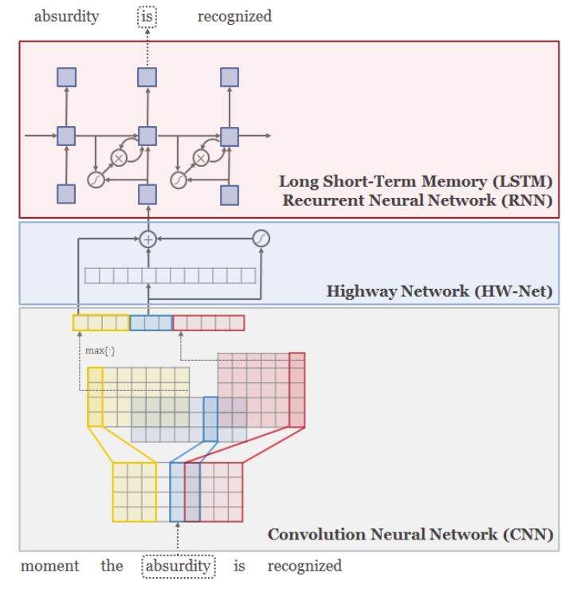

# Character-Aware Neural Language Models

This is an implementation of the paper [Character-Aware Neural Language Models](https://arxiv.org/pdf/1508.06615.pdf)

# The review of the paper

[[NLP] Character-Aware Neural Language Models](https://lee-soohyun.tistory.com/186)
